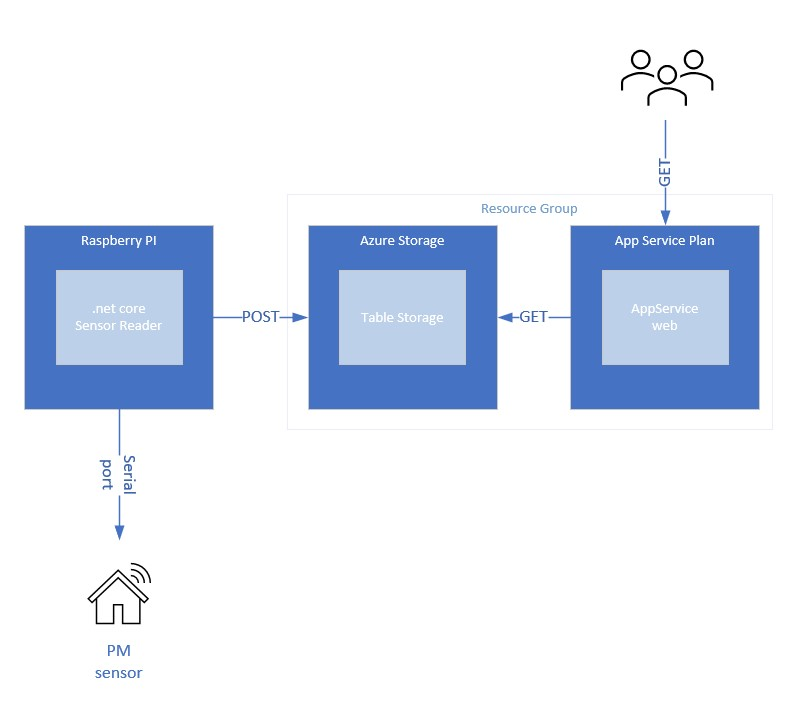
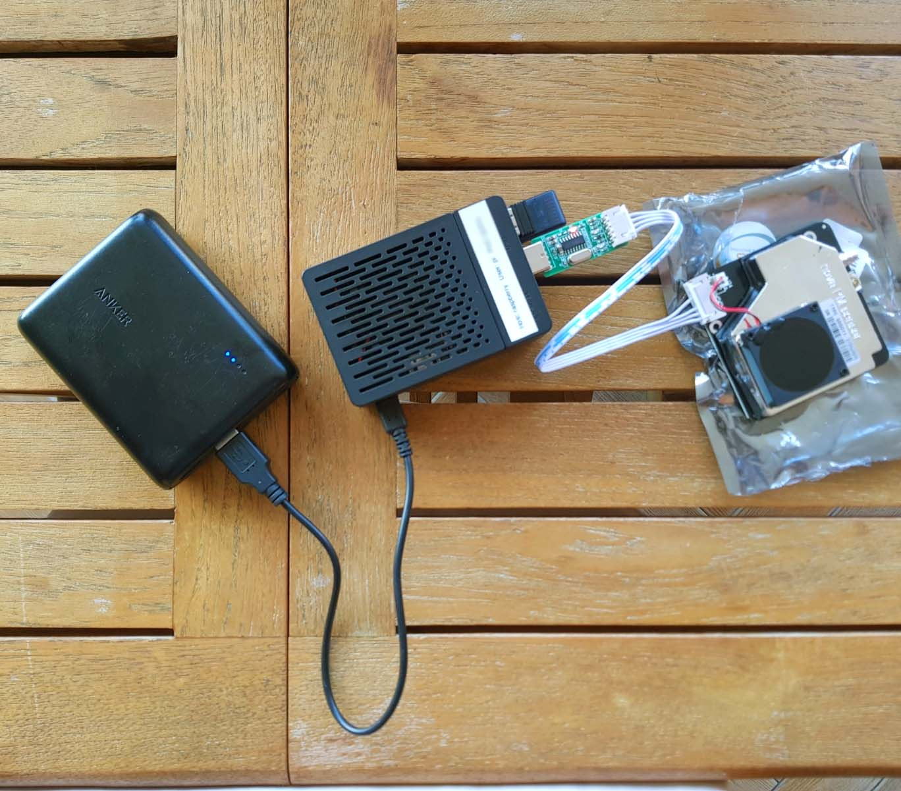

.NET CORE app that reads from Nova PM Sensor SDS011 High Precision Laser PM2.5 Air Quality Detection Sensor

**Publish for Raspberry**

dotnet publish -o publish --self-contained -r linux-arm

**Copy to raspberry ALL files**

scp .\publish\\* pi@raspberry.fritz.box:/home/pi/projects/core-sensor-reader/

**Copy to raspberry only 'core-*' files**

scp .\publish\core-* pi@raspberry.fritz.box:/home/pi/projects/core-sensor-reader/

**How to run app on a Raspberry**

cd /home/pi/projects/core-sensor-reader/

chmod 777 ./core-sensor-reader

./core-sensor-reader
